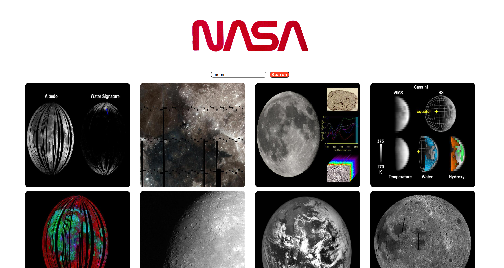
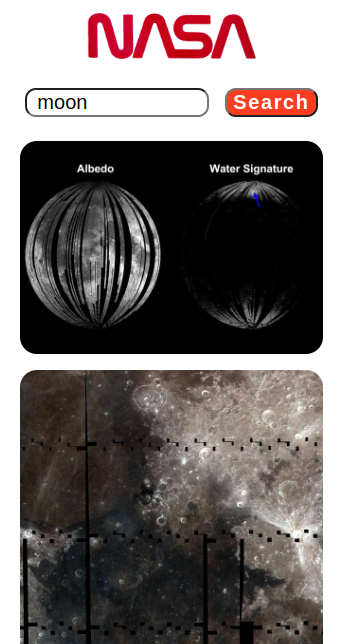

# React Technical Test

## Description

The task was to build a React web application that allows users to search for images based on a query to the NASA API endpoint.

I previously created this project using create-react-app, but I have done this one using Vite, to try and familiarise myself with it.

## Deployed Site

[React Tech Test Vite](https://react-tech-test-vite.vercel.app/)

## Screenshots

### Desktop



### Mobile



## Technology

The app was build using React, and the testing utilities were Jest and React Testing Library

### Packages

The main package used was axios, which we used for HTTP requests.

Create-react-app was used to initially setup the project.

## Instructions

Once you have cloned the app, run ```npm install``` in the terminal. Once installation has completed, you should be able to use ```npm start```, which will open the app in your browser.

From here, you can enter a search term, e.g. Supernova, and if there are any search results, these images would be displayed to the user.

### Things I Would Like to Add

I'd like to add the option to only display a smaller amount of results initially, then if the user wanted to see more, they can click a button that will load more images.

Also, it would be interesting to display information about the image if the user hovered over or clicked on the image.

#### Author

Timothy Bracey
